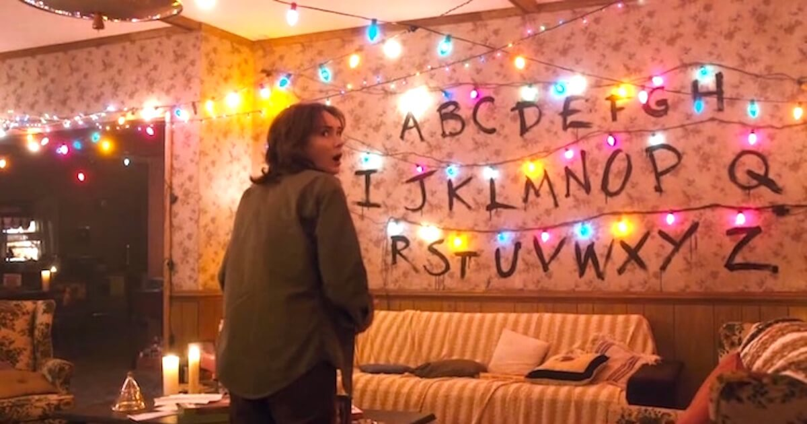

# Stranger Things Alphabet T-Shirt 

Build a stranger things t-shirt message using a Rasperrry Pico-W & WS2812 (NeoPixel). 



## Hardware 

 * Pico-W
  * You can use a regular pico, if you don't want the ability to change the message as needed.
 * WS2812 - 26 LEDs Neopixel
 * Bunch of wiring
 * Solder wire for connecting wires and LED.

## Code 

The code is written in MicroPython. Refer `stranger_leds.py` for complete code.

### Configuration 

Change the following parameters to customize per your need.

#### Wi-Fi Credentials 

We are using an iPhone as a hotspot for the Pico, when ever we want to change the messaging. Change the variables to your Wifi Access point.

```
SSID = 'iPhone'
PASSWORD = 'Hall0W33n'
```

#### LED count

Default WS2812 have 30 pixels, but since we need 26, we are setting that as the limit. If you want to add special characters, feel free to modify.

```
# We are using 26 LEDs, each corresponding to an alphabet
LEDS = 26
```

#### Pico GPIO pin numbers

```
# Data in Pin for WS2812
LEDS_PIN = 13

# Button GPIO pin to trigger LEDs when pressed
BUTTON = Pin(23, Pin.IN)
```

#### Default Message

```
# Default Message 
MESSAGE = 'You Shouldnt Have Upset Him'
```

Add your [own custom message](https://sarahscoop.com/100-best-quotes-from-netflixs-stranger-things/) as the default one, if you don't like the one we have.

Modify the code, push it to Pico and have fun...

## Wire T-Shirt 

> Add photos of wiring here
